<div align="center">
  <br />
    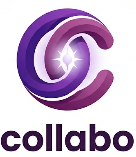
  <br />
  <h1 align="center">Collabo</h1>
  <p align="center">
    <strong>A next-generation real-time collaborative study room platform.</strong>
    <br />
    Focus deeper, study smarter, and connect with peers around the world.
  </p>
  <p align="center">
    <a href="https://collabo-room.vercel.app"><b>🔴 View Live Demo</b></a>
  </p>
</div>

<details open="open">
  <summary>Table of Contents</summary>
  <ol>
    <li><a href="#-about-the-project">About The Project</a></li>
    <li><a href="#-key-features">Key Features</a></li>
    <li><a href="#-tech-stack">Tech Stack</a></li>
    <li><a href="#-getting-started">Getting Started</a></li>
    <li><a href="#-api-endpoints">API Endpoints</a></li>
  </ol>
</details>

## 🚀 About The Project

Collabo is a highly interactive, beautifully designed virtual study platform built to keep you productive. Whether you need a private room to cram with friends, or a 24/7 public study hall to stay accountable, Collabo provides the ultimate environment to track your time, listen to ambient focus music, and eliminate distractions.


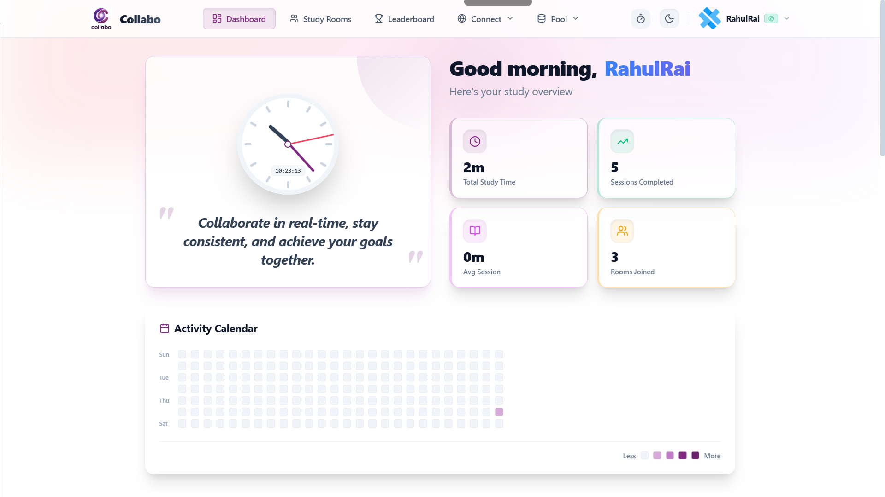

## ✨ Key Features

### 👥 Real-Time Collaboration
See exactly who is studying with you, right now. 
- **Live Members Panel:** Slide-out panel to view who is currently focusing or taking a break.
- **Global Chat:** Real-time socket-based messaging within your room.
<!-- Add Screenshot Here (Live Panel & Chat) -->
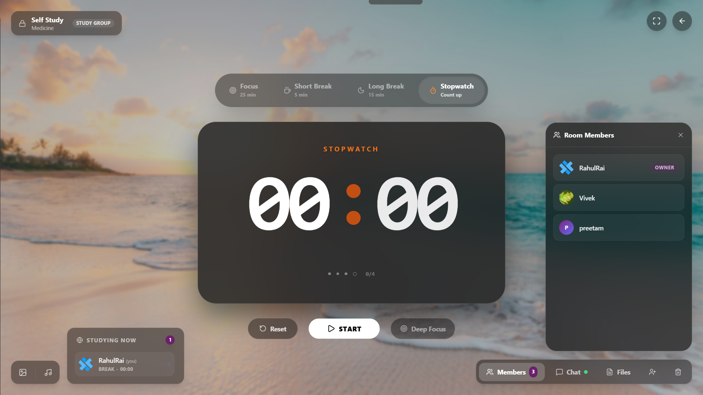


### 🔒 Private & Public Study Rooms
Create dedicated environments for any type of study session:
- **Public Study Halls:** Meet new people and study together.
- **Private Rooms:** Lock rooms with a passcode or invite-only links.
- **Invite System:** Easily invite friends by their username or share a 6-digit room code.
<!-- Add Screenshot Here (Room Creation Modal) -->
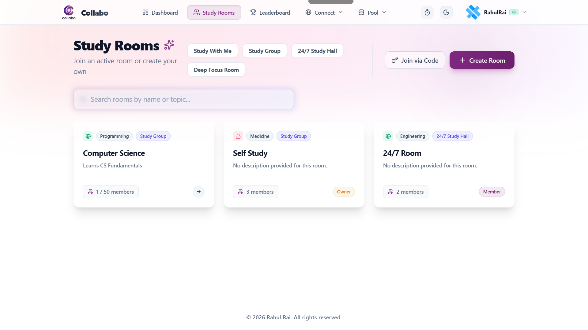


### 🎯 Deep Focus Mode & Distraction Tracking
Eliminate procrastination with the **Deep Focus Mode**. When enabled, the app enters fullscreen and tracks your tab-switches and window minimizes.
- Auto-punishes distractions with a 3-strike system.
- Alerts you when you leave the study tab.
<!-- Add Screenshot Here (Deep Focus Distraction Warning) -->
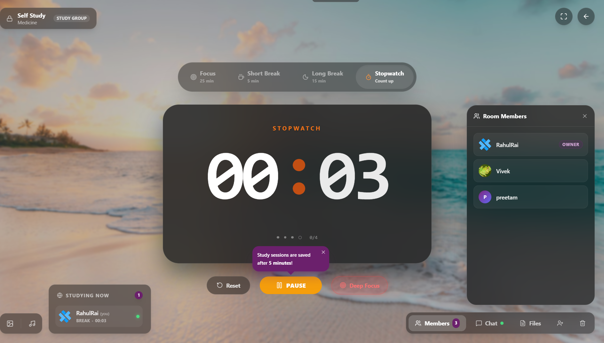
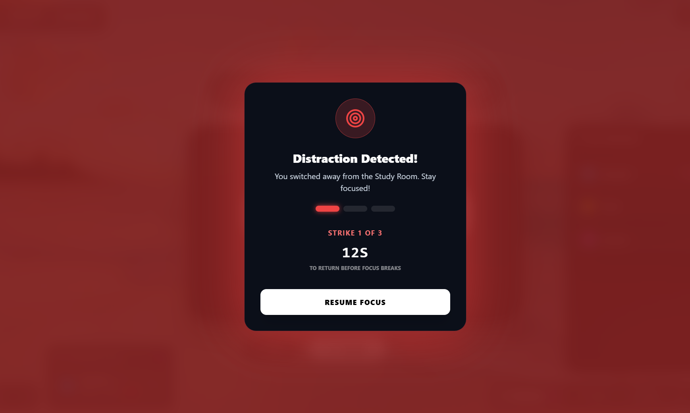
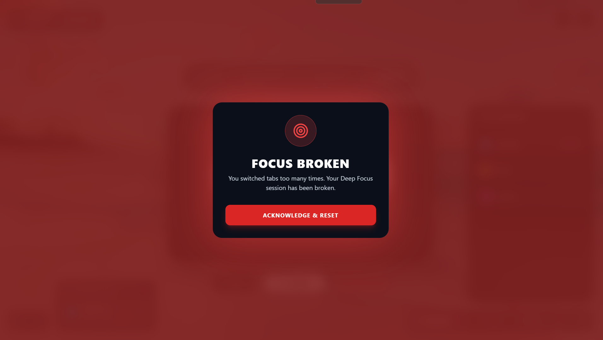
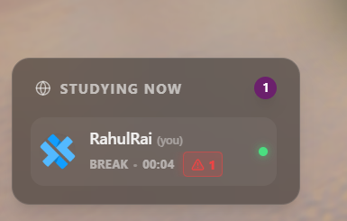

### 📊 Comprehensive Activity Tracking
Your study time is precious, so we automatically log it for you.
- **Auto-Save:** Sessions are securely auto-saved to the database even if you accidentally close the tab (with a smart 5-minute minimum threshold).
- **Global Leaderboard:** Compete with other students and rank up by accumulating study hours.
- **Activity Calendar:** GitHub-style contribution graph showing your daily study habits.
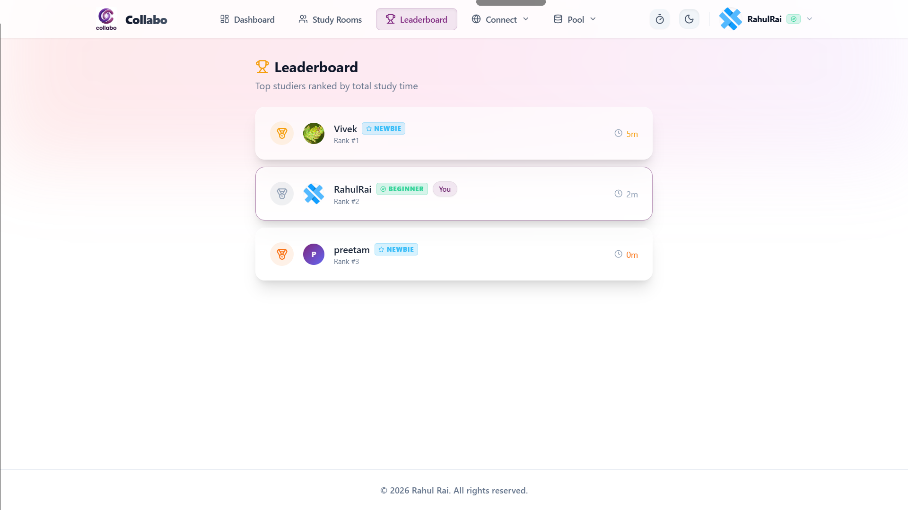
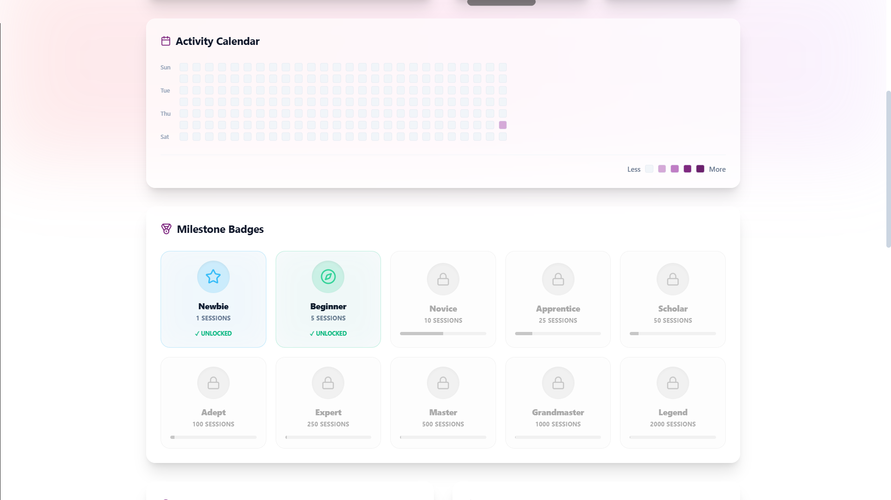
### 📁 File Sharing & Shared Notes
Upload and pin study materials directly to the room for everyone to access.
- Upload PDF, Images, or Documents.
- Everyone in the room can instantly download shared resources.
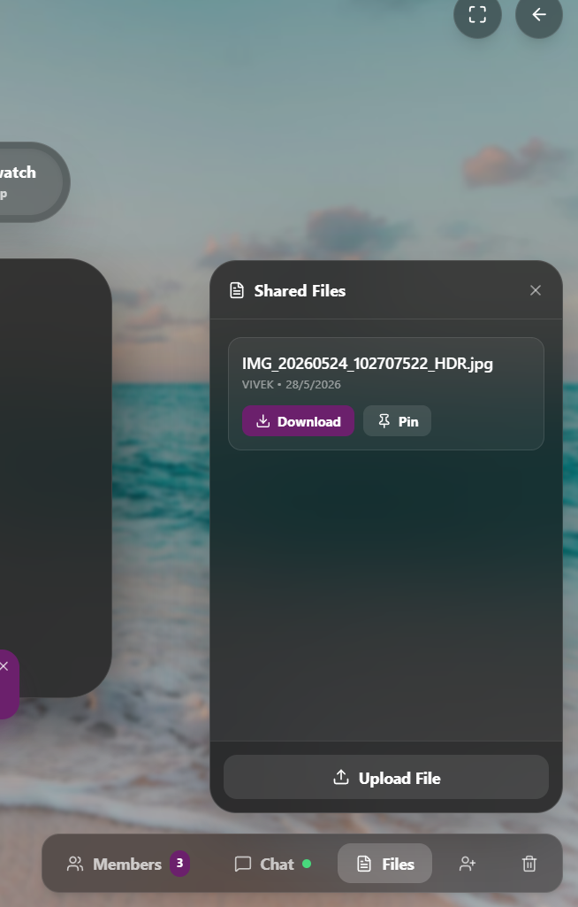

### 🎧 Built-in Ambient Music Player
Study in the zone without leaving the app. The integrated music player streams Lofi and Ambient tracks directly from a cloud CDN (Cloudinary) to ensure zero lag.
<!-- Add Screenshot Here (Music Player Panel in Room) -->
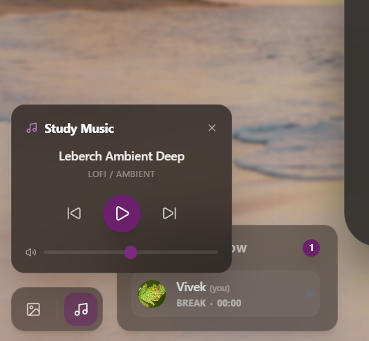

### 📱 Responsive Mobile Layout
Study on the go! The entire platform is fully optimized for mobile devices.
- Custom slide-out menus designed for phone screens.
- Mobile-optimized deep focus tracking.
<p align="center">
  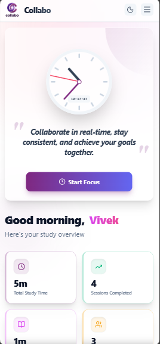
  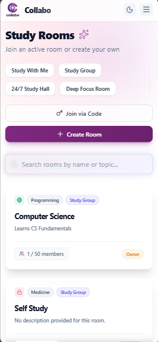
  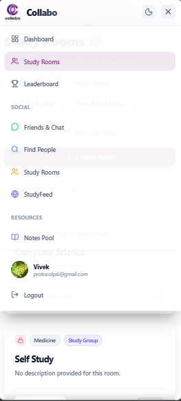
</p>

### 🎨 Customizable Themes & Backgrounds
Personalize your study environment to fit your mood.
- Switch between multiple beautiful HD backgrounds (Beach, Forest, Gradient, etc.)
- Fully supported Dark Mode and Light Mode for the entire application.
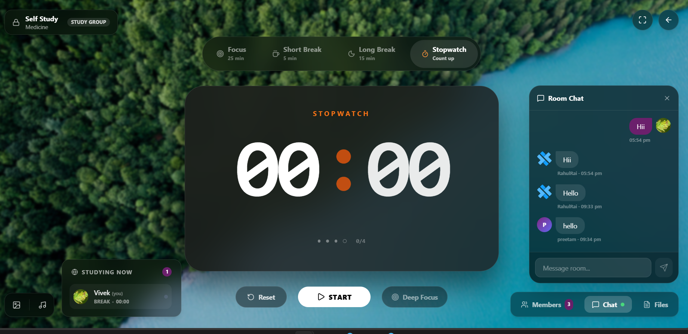
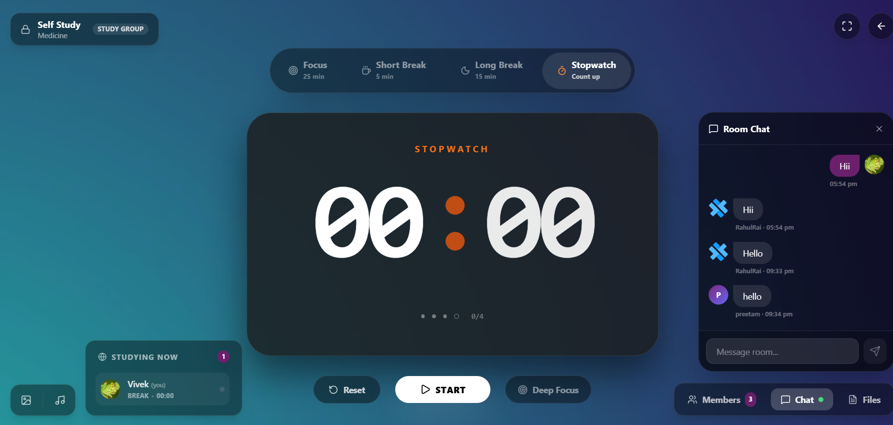
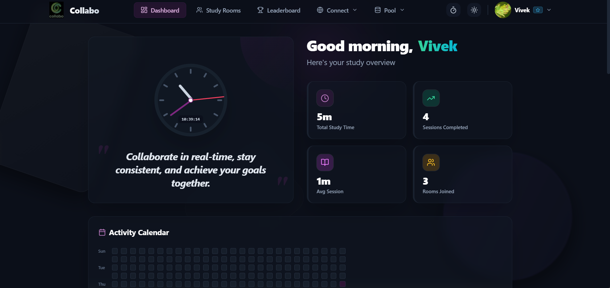
## 🛠 Tech Stack

Collabo is built with modern web technologies to ensure a snappy, real-time experience.

| Layer | Technology |
|---|---|
| **Frontend** | React 18, Vite, Tailwind CSS, Lucide Icons |
| **Backend** | Node.js, Express.js |
| **Database** | MongoDB & Mongoose |
| **Real-Time** | Socket.io (WebSockets) |
| **File Storage** | Cloudinary (CDN for Audio & Images) |

## 🚀 Getting Started

### Prerequisites
- Node.js v18+
- MongoDB Atlas Account
- Cloudinary Account (for hosting music and avatars)

### 1. Clone & Install
```bash
git clone https://github.com/rahulrai19/collabo-Collaborative-Study-Room-Platform.git

cd studyroom

# Install Backend
cd server && npm install

# Install Frontend
cd ../client && npm install
```

### 2. Environment Variables

Create a `.env` file in the `server` directory:
```env
PORT=5000
MONGO_URI=mongodb+srv://<user>:<password>@cluster0.mongodb.net/collabo
JWT_SECRET=your_super_secret_jwt_key
CLIENT_URL=http://localhost:5173

# Cloudinary Setup for Media
CLOUDINARY_CLOUD_NAME=your_cloud_name
CLOUDINARY_API_KEY=your_api_key
CLOUDINARY_API_SECRET=your_api_secret
```

### 3. Run the App

Start both servers in development mode:
```bash
# Terminal 1 (Backend)
cd server && npm run dev

# Terminal 2 (Frontend)
cd client && npm run dev
```
Your frontend will be available at `http://localhost:5173`.

## 🌐 API Endpoints

### Authentication
- `POST /api/auth/register` - Create an account
- `POST /api/auth/login` - Authenticate & receive JWT
- `GET /api/auth/me` - Validate JWT session

### Rooms & Sessions
- `GET /api/rooms` - Fetch all public/accessible rooms
- `POST /api/rooms` - Create a new room
- `POST /api/rooms/join/code` - Join a private room via 6-digit code
- `POST /api/sessions/log` - Auto-log completed or partial focus sessions
- `GET /api/music` - Fetch dynamic Cloudinary music playlist

---
<div align="center">
  <i>Built with ❤️ for focused studying By Rahul Rai.</i>
</div>
